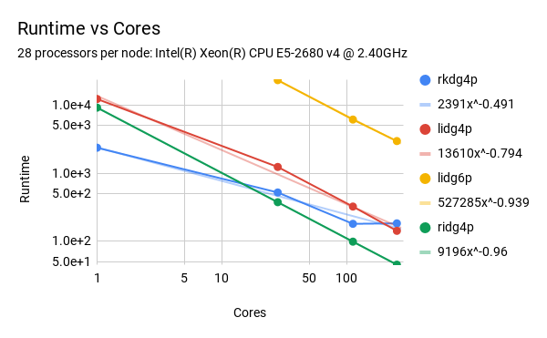

## The Regionally-Implicit Discontinuous Galerkin scheme (RIDG)

With [James Rossmanith](https://faculty.sites.iastate.edu/rossmani/), I am developping a numerical method for nonlinear hyperbolic conservation laws which is able to take a greatly enhanced timestep by mixing ideas of implicit and explicit time-step schemes.
So far, we have seen that this method allows a CFL restriction that is **independent of of method order of accuracy**. The CFL restriction depends only on the _problem dimension_ and the _choice of basis_ :

| Problem | CFL |
|----|-----|
| 1D  | 1.0  | 
| 2D  | 0.75 |
| 3D  | 0.6  |

Since this allows the method to take almost two orders of magnitudes fewer timesteps to obtain the same solution as an Runge-Kutta DG method, 
parallel computing via domain decomposition is incredibly efficient for the RIDG method. Here is a strong scaling study of RIDG vs RKDG vs LIDG for a 2D periodic problem: 

More details can be found in these papers

[The Regionally-Implicit Discontinuous Galerkin Method: Improving the Stability of DG-FEM](https://arxiv.org/abs/1711.03447)

[(coming soon) P.T. Guthrey and J.A. Rossmanith. The regionally-implicit discontinuous Galerkin method: Highly scalable parallel implementation.](./)

[back](./)
