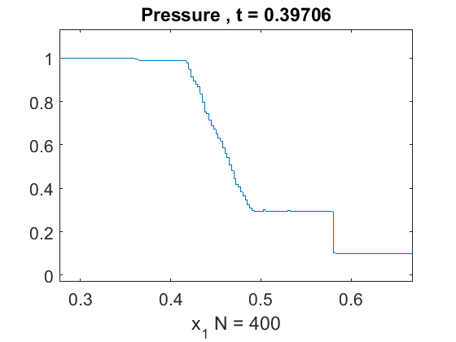
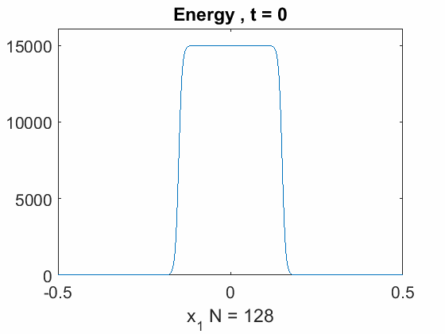

## Shock Hydrodynamics

Limiters are critical to preventing the spurious oscillations inherent to most numerical schemes from destroying your solution. Complicated limiters can be computationally expensive, which may destroy your method efficiency and/or scalability. Simple limiters may prevent catastrophic problems in your solution but may cause unphysical behavior.  

#### Sod Shock Tube

An overzealous troubled cell indicator erronously flags the cells within the rarefraction wave as troubled cells, dropping them to first order accuracy and causing a staircasing effect.

#### Sedov Blast Wave

Here is an example of the Sedov blast wave, which is computationally challenging due to the large discontinuity in the pressure.
In the below example, we see a 1D slice of a 2D simulation. A simple bounds limiter causes waves to unphysically reflect back from the  shock front and collide in the center. 

More details can be found here:

[(coming soon) P.T. Guthrey and J.A. Rossmanith. The regionally-implicit discontinuous Galerkin method extended to nonlinear systems with shock capturing limiters.](./)

[back](./)
